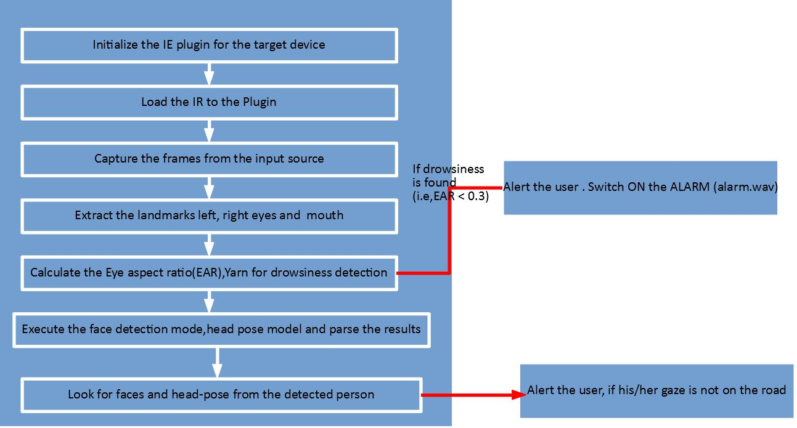

# Intel-Edge-AI-Scholarship-Project
This is the repository for the project showcase for the Udacity's Intel® Edge AI Scholarship Phase 1 Course

##### Project Name: Driver Gaze and Drowsiness monitoring System

#### Project Story: " I was curious on working safety systems earlier, be operators' industrial operational floor or safety of drivers'.For the latter, i need to monitor the drivers' gaze and state of drowsiness.This has been achieved using the OpenVINO pretrained models and Image processing libraries OpenCV, dlib,imutils."

### 1.Introduction

This project showcase Driver Behaviour case scenario using  the Intel’s OpenVINO toolkit.Drowsiness is detected based on blinking  and gaze direction. For that, we will use the OpenVINO toolkit and OpenCV, all written in python.

We will develop the following features based on computer vision:

1) Sleep/Drowsiness Detection:

   - Counting frecuency of blinking.
   - Yawn detection.

2) Gaze detection.

### 2.Logic

Using OpenVino’s model detection we can easily detect faces with great accuracy. Also, head pose can be detected using the corresponsing model fromm the open vino model zoo.I'm using 2 different models that are included with OpenVino out-of-the-box:

   - face-detection-adas-0001
   - head-pose-estimation-adas-0001

2.1. Blink/Yawn detection

Using the image detected inside the face ROI (region of interest), we feed a facial landmarks detector to identify points of iterest. Using 6 points for each eye and 6 points for the mouth it is possible to calculate 'Eye Aspect Ratio (EAR)' that gives 2 values for eye/mouth open or closed (based on this paper).

- EAR

At the moment of writing this guide, the facial landmarks detection model included with OpenVino (facial-landmarks-35-adas-0001) has not enough points to run this calculations.I'm using dlib’s facial landmarks detector instead.

Once we have a positive detection for blink/yawn, we count frames of those events and trigger an alarm when they hit a threshold.

2.2. 'Eyes on the road' detection

Using the face’s ROI, we feed a head-pose detector model provided by OpenVino (head-pose-estimation-adas-0001). Analizing the output of that model we can easily detect when the face is not centered or not looking to the front.

#### 3.How it works

The application is invoked from command line. It reads the specified input video stream frame-by-frame, be it a camera device or a video file, and performs independent analysis of each frame. In order to make predictions the application deploys 3 models on the specified devices using OpenVINO library and runs them in asynchronous manner. The input frame is processed to detect face landmarks (68 nos) using dlib's face detector and landmark predictor. Using the face landmarks, drowsiness (Counting frecuency of blinking , Yawn detection ) is measured. Then input frame is processed by the face detection model to predict face bounding boxes.The final step in frame processing is done by the head pose estimation model, which outputs head position in terms of yaw, pitch and roll. Then, the processing results are visualized and displayed on the screen .

A basic workflow of the whole architecture is shown below:

#### 4.Hardware

Target and development platforms meeting the requirements described in the "System Requirements" section of the OpenVINO™ toolkit documentation which may be found at: https://software.intel.com/en-us/openvino-toolkit

Note: While writing this tutorial, an Intel® i7-9750U with Intel® UHD graphics 630  GPU was used as both the development and target platform.

##### 5.Software Installation and dependencies

##### Software
   - OpenVINO™ toolkit supported Linux operating system. This tutorial was run on 64-bit Ubuntu 16.04.1 LTS updated to kernel 4.15.0-43       following the OpenVINO™ toolkit installation instructions. Also tested on Ubuntu 18.04.

   - The latest OpenVINO™ toolkit installed and verified. Supported versions 2019 R2. (Older versions are supported on another branch).

   - Git(git) for downloading from the GitHub repository.
   
The demo depends on:
- OpenVINO library (2019R3 or newer)
- Python ( 3.65+, which is supported by OpenVINO)
- OpenCV (>=3.4.0)
- dlib 
- imutils
- playsound

To install all the required Python modules you can use:

    pip install -r requirements.txt
    
#### 6.Running the demo:

Step 1) Activate the openVINO environment using the following command from the command prompt:
            
            cd C:\Program Files (x86)\IntelSWTools\openvino\bin\ 
            setupvars.bat       
step 2)  Enter in to the project download folder from the command line and run the following command: you can aso run the app in sync and async mode with optional -f flag.By default the app runs in async mode.

##### Async mode:
For windows:

            python app.py -mf "A:\\IntelOpenVinoWorkspace\\Intel-Edge-AI-Scholarship\\models\\face-detection-adas-0001\\FP32\\face-detection-adas-0001.xml" -mp "A:\\IntelOpenVinoWorkspace\\Intel-Edge-AI-Scholarship\\models\\head-pose-estimation-adas-0001\\FP32\\head-pose-estimation-adas-0001.xml" -l "C:\\Program Files (x86)\\IntelSWTools\\openvino\\deployment_tools\\inference_engine\\bin\\intel64\\Release\\cpu_extension_avx2.dll" -d CPU -pt 0.7
   
 For Linux, the model 
 
            replace the CPU, model paths with the corresponding in your linux machine
 
 ##### sync mode:
 For windows:

            python app.py -mf "A:\\IntelOpenVinoWorkspace\\Intel-Edge-AI-Scholarship\\models\\face-detection-adas-0001\\FP32\\face-detection-adas-0001.xml" -mp "A:\\IntelOpenVinoWorkspace\\Intel-Edge-AI-Scholarship\\models\\head-pose-estimation-adas-0001\\FP32\\head-pose-estimation-adas-0001.xml" -l "C:\\Program Files (x86)\\IntelSWTools\\openvino\\deployment_tools\\inference_engine\\bin\\intel64\\Release\\cpu_extension_avx2.dll" -d CPU -pt 0.7 -f sync
   
 For Linux, the model 
 
            replace the CPU, model paths with the corresponding in your linux machine
 #### 7. Sample output
 The output video in mp4 format is wriiten into "output_snapshots" folder which is created when the App runs. Outputfile vide is named "outpy.mp4"
 
 
